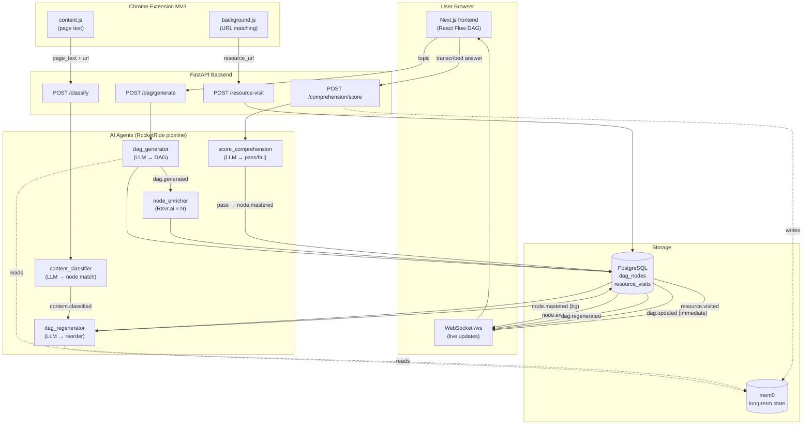

# Learnograph.ai

> AI-powered developer learning roadmap generator with real-time voice comprehension checks.

**Built for the PDD Hackathon** — powered by MiniMax (via TokenRouter), Rtrvr.ai, mem0, RocketRide, and ElevenLabs.

---

## Table of Contents

- [Overview](#overview)
- [Architecture](#architecture)
- [Tech Stack](#tech-stack)
- [How It Works](#how-it-works)
- [Project Structure](#project-structure)
- [Setup](#setup)
- [API Reference](#api-reference)
- [Chrome Extension](#chrome-extension)
- [Environment Variables](#environment-variables)
- [Event Pipeline](#event-pipeline)
- [Node Status Lifecycle](#node-status-lifecycle)
- [Key Design Decisions](#key-design-decisions)

---

## Overview

Learnograph generates a personalized, prerequisite-aware learning DAG (Directed Acyclic Graph)
from any developer topic. Type "Learn React" and receive a structured roadmap of 5–30 nodes with
dependency relationships, curated resources, and oral comprehension checks.

**The feedback loop:**

1. An LLM generates the DAG and sorts it topologically (root concepts first).
2. A Chrome extension watches your browsing and silently maps visited pages to DAG nodes.
3. When you feel ready, a voice check (ElevenLabs STT/TTS) confirms conceptual understanding.
4. Passing unlocks the next layer of nodes immediately — no page refresh needed.
5. Long-term learning state (mastered nodes, pace) persists in mem0 across sessions.

---

## Architecture



---

## Tech Stack

### Backend

| Layer | Technology | Version |
|-------|-----------|---------|
| Runtime | Python | 3.11 |
| API framework | FastAPI | 0.115 |
| Database driver | asyncpg (PostgreSQL) | 0.30 |
| LLM client | openai (OpenAI-compatible) | 1.59 |
| LLM provider | TokenRouter → Claude Sonnet 5 / MiniMax-M3 | — |
| Long-term memory | mem0 (MemoryClient) | 0.1.74 |
| Web search/scrape | Rtrvr.ai `/scrape` + `/agent` | — |
| Pipeline orchestration | RocketRide pub/sub | — |
| HTTP client | httpx (async) | 0.28 |
| Validation | Pydantic v2 | 2.10 |

### Frontend

| Layer | Technology | Version |
|-------|-----------|---------|
| Framework | Next.js (App Router) | 15.1 |
| UI library | React | 19 |
| DAG visualization | @xyflow/react (React Flow) | 12.3 |
| Voice I/O | ElevenLabs (TTS + STT) | 1.50 |
| Real-time | WebSocket (native) | — |
| Language | TypeScript | 5 |

### Infrastructure

| Component | Technology |
|-----------|-----------|
| Database | PostgreSQL 14+ |
| Deployment | Render (render.yaml) |
| Extension | Chrome MV3 |

---

## How It Works

### 1. DAG Generation

User submits a topic (e.g., "Learn React") via the web UI.

- **Route**: `POST /dag/generate`
- Reads the user's learning profile from mem0 (mastered nodes, pace).
- `dag_generator` calls the LLM with a structured system prompt, receives a JSON array of nodes.
- `_parse_nodes` builds an `id_map` (LLM-ID → slug) **before** overriding node IDs, remapping all
  prerequisite references to matching slugs. This normalisation is critical — without it, all
  dependency checks silently fail.
- `_normalize_statuses` marks root nodes (no prerequisites) as `available`, all others `locked`.
  Nodes whose prerequisites are all mastered (returning users) are also marked `available`.
- `_topo_sort` (Kahn's algorithm) reorders nodes so prerequisites always precede dependants.
- Nodes are persisted to Postgres and `dag.generated` is published to the RocketRide pipeline.

### 2. Node Enrichment

Triggered by `dag.generated`, `node_enricher.handle_dag_generated` enriches all nodes in parallel.

For each node, three Rtrvr.ai `/agent` searches run concurrently:

1. **Tutorial article** — Medium, Dev.to, freeCodeCamp, web.dev, etc.
2. **Official documentation** — maintainer's own docs (e.g., react.dev, docs.python.org).
3. **YouTube tutorial** — developer-focused video covering the node's `success_criteria`.

Each search is wrapped in `try/except`; if Rtrvr.ai fails, a deterministic fallback search URL
is returned (freeCodeCamp search, MDN search, YouTube search). The function never raises and
always returns exactly 3 resources.

**Ordering is critical**: `postgres.update_node_resources()` runs first, then `node.enriched` is
published. Publishing before the DB write would cause the subscriber to read empty resources.

### 3. Browsing Detection (Chrome Extension)

On each page load, `content.js` extracts the page title, meta description, and body text.
`background.js` checks if the current URL is a known resource URL by polling
`GET /dag/resources/{session_id}`.

- **Resource URL match**: `POST /resource-visit` → the node transitions `available → seen`.
  The `resource_visits` table records the visit (idempotent). A `resource.visited` event triggers
  an immediate WebSocket broadcast.
- **No match**: `POST /classify` with the page text → `content_classifier` asks the LLM to map
  the text to the best available node. If matched, `content.classified` triggers `dag_regenerator`.

### 4. Comprehension Check

User clicks a `seen` or `available` node → NodePanel shows resources → "Start Check" opens VoiceCheck.

**Gate**: `/comprehension/score` first calls `has_visited_any_resource()`. If no resource has been
visited for the node, it returns HTTP 403. This ensures the oral check tests genuine engagement.

**Voice loop** (in `VoiceCheck.tsx`, not inside any agent):
1. ElevenLabs TTS reads the `success_criteria` question aloud.
2. ElevenLabs STT records and transcribes the user's spoken answer.
3. The transcription is sent to `/comprehension/score`.

**`score_comprehension`** passes the `success_criteria` + transcribed answer to the LLM with a
strict rubric: pass only for substantive understanding in the learner's own words. Verbatim
repeats → `needs_review`. Non-native phrasing and filler words are not penalised.

**On pass** (in the route, not the agent):
1. Node status → `mastered` in Postgres.
2. `unlock_eligible_nodes()` immediately transitions every dependent node whose prerequisites
   are all mastered to `available` — before any LLM runs.
3. `record_node_mastered()` writes to mem0 (async, graceful degradation on failure).
4. `node.mastered` published → `_on_node_mastered` broadcasts current DB state to all WebSocket
   clients **immediately**, then fires `handle_node_mastered` as an `asyncio.create_task()`.

The frontend also calls `refresh()` (HTTP GET `/api/dag/{sessionId}`) on a pass verdict,
providing a second fast path independent of the WebSocket pipeline.

### 5. DAG Regeneration

`dag_regenerator` runs after `content.classified` or `node.mastered` events. It:

1. Asks the LLM to reorder nodes by estimated fit given the user's learning pace (from mem0
   `completed_at` timestamps).
2. Validates the LLM output with belt-and-suspenders rules: no nodes dropped (R1), prerequisites
   unchanged (R3), immutable fields restored (R4), mastered status never regressed (R5), `seen`
   status never regressed (R8).
3. Falls back to a deep copy of `current_dag` if the LLM call fails (R9).
4. A final programmatic pass unlocks all nodes whose prerequisites are all mastered (R2).
5. Publishes `dag.regenerated` → second WebSocket broadcast (LLM-reordered view).

---

## Project Structure

```
learnograph.ai/
├── backend/
│   ├── agents/
│   │   ├── dag_generator.py       # topic + user_profile → DAG (LLM)
│   │   ├── node_enricher.py       # node → 3 resources (Rtrvr.ai)
│   │   ├── dag_regenerator.py     # DAG reorder + unlock (LLM + rule-based)
│   │   ├── comprehension.py       # oral answer scorer (LLM)
│   │   └── content_classifier.py  # page text → node match (LLM)
│   ├── db/
│   │   ├── postgres.py            # all async Postgres CRUD
│   │   └── migrations/
│   │       ├── 001_initial.sql    # sessions + dag_nodes tables
│   │       └── 002_resource_visits.sql  # resource_visits table
│   ├── memory/
│   │   └── mem0_client.py         # async wrappers over MemoryClient
│   ├── models/
│   │   └── dag.py                 # all Pydantic models + enums
│   ├── orchestration/
│   │   └── rocketride_client.py   # publish/subscribe
│   ├── routes/
│   │   ├── dag.py                 # /dag/generate, /dag/{id}, /dag/resources/{id}
│   │   ├── classify.py            # /classify
│   │   ├── comprehension.py       # /comprehension/score
│   │   └── resource_visit.py      # /resource-visit
│   ├── config.py                  # pydantic-settings, reads .env
│   └── main.py                    # FastAPI app, WebSocket, RocketRide subscribers
├── frontend/
│   ├── app/
│   │   └── page.tsx               # main page, topic input, panels
│   ├── components/
│   │   ├── DAGCanvas.tsx          # React Flow, topological depth layout
│   │   ├── NodePanel.tsx          # resource sidebar, start check button
│   │   └── VoiceCheck.tsx         # ElevenLabs TTS/STT, sends to /score
│   ├── hooks/
│   │   └── useWebSocket.ts        # WS client + refresh() HTTP fallback
│   └── types/
│       └── dag.ts                 # DAGNode, Resource, NodeStatus types
├── extension/
│   ├── background.js              # URL matching, /resource-visit, /classify
│   ├── content.js                 # page text extraction
│   └── manifest.json              # MV3, activeTab + scripting permissions
├── prompts/                       # PDD prompt files (one per agent + resource_visit)
│   ├── generate_dag.prompt
│   ├── enrich_node.prompt
│   ├── regenerate_dag.prompt
│   ├── comprehension_check.prompt
│   ├── classify_content.prompt
│   └── resource_visit.prompt
├── user_stories/                  # contract acceptance stories per agent rule
├── context/
│   └── project_preamble.prompt    # shared context included by all prompts
├── tests/                         # pytest-asyncio test suite
├── learnograph.pipe               # RocketRide pipeline topology (JSON)
├── render.yaml                    # Render deployment config
├── requirements.txt
└── .env.example
```

---

## Setup

### Prerequisites

- Python 3.11+
- Node.js 18+
- PostgreSQL 14+
- API keys: TokenRouter (or any OpenAI-compatible LLM), mem0, Rtrvr.ai, ElevenLabs

### 1. Clone and install backend dependencies

```bash
git clone https://github.com/prashanth-s-01/learnograph.ai
cd learnograph.ai
python -m venv .venv && source .venv/bin/activate
pip install -r requirements.txt
```

### 2. Configure environment

```bash
cp .env.example .env
# Fill in your API keys (see Environment Variables section)
```

### 3. Set up PostgreSQL

```bash
createdb learnograph
# Migrations run automatically on startup via run_migrations()
# No manual migration step needed
```

### 4. Start the backend

```bash
uvicorn backend.main:app --reload --port 8000
# API: http://localhost:8000
# Docs: http://localhost:8000/docs
# WebSocket: ws://localhost:8000/ws
```

### 5. Install and start the frontend

```bash
cd frontend
npm install
cp .env.local.example .env.local
# Add NEXT_PUBLIC_ELEVENLABS_API_KEY and NEXT_PUBLIC_ELEVENLABS_VOICE_ID
npm run dev
# Frontend: http://localhost:3000
```

### 6. Load the Chrome extension

1. Go to `chrome://extensions`
2. Enable **Developer mode** (toggle, top right)
3. Click **Load unpacked** and select the `extension/` directory
4. The Learnograph extension icon appears in the toolbar

### 7. Run the tests

```bash
pytest tests/ -v
```

---

## API Reference

### DAG

| Method | Path | Request | Description |
|--------|------|---------|-------------|
| `POST` | `/dag/generate` | `{ topic, session_id }` | Generate a new DAG. Clears existing nodes for the session first. |
| `GET` | `/dag/{session_id}` | — | Get all nodes for a session, ordered by `created_at`. |
| `POST` | `/dag/regenerate` | `{ session_id }` | Manually trigger LLM-based DAG reordering. |
| `GET` | `/dag/resources/{session_id}` | — | Returns `{ node_id: [resource_urls] }` for available/seen nodes. Used by the Chrome extension. |

### Comprehension

| Method | Path | Request | Response |
|--------|------|---------|----------|
| `POST` | `/comprehension/score` | `{ node_id, success_criteria, transcribed_answer, session_id }` | `{ verdict: "pass"\|"needs_review", feedback: string }` |

**Note**: Returns HTTP 403 if no resource has been visited for the node.

### Classification

| Method | Path | Request | Response |
|--------|------|---------|----------|
| `POST` | `/classify` | `{ page_url, session_id, page_text? }` | `{ matched_node_id: string\|null }` |

If `page_text` is provided by the extension, Rtrvr.ai scraping is skipped.

### Resource Visits

| Method | Path | Request | Response |
|--------|------|---------|----------|
| `POST` | `/resource-visit` | `{ session_id, node_id, resource_url }` | `{ recorded: bool, status_changed: bool }` |

Returns HTTP 404 if the node doesn't exist, HTTP 400 if the URL is not a known resource for that node.

### WebSocket

Connect to `ws://localhost:8000/ws`. The server pushes JSON events:

```json
{
  "event": "dag.generated" | "dag.updated" | "dag.regenerated",
  "data": {
    "nodes": [ ...DAGNode[] ]
  }
}
```

Send any text frame to keep the connection alive (the server reads but ignores the payload).

---

## Chrome Extension

The extension runs a content script (`content.js`) on every page (`<all_urls>`).

**On each page navigation** (`background.js`):

1. Receives extracted `{ title, url, text }` from `content.js`.
2. Fetches the current resource URL map from `GET /dag/resources/{session_id}`.
3. **If the URL matches a known resource for a node**: `POST /resource-visit` →
   node transitions `available → seen`, WebSocket broadcast fires, DAG updates in the browser.
4. **Otherwise**: `POST /classify` with `page_text` → if the LLM matches a node,
   `content.classified` triggers `dag_regenerator` which reorders the DAG in the background.

**Permissions** (`manifest.json`):
- `activeTab` — read the current tab's URL
- `scripting` — inject `content.js` to extract page text
- `host_permissions: <all_urls>` — required to POST to the local backend

---

## Environment Variables

| Variable | Description | Default |
|----------|-------------|---------|
| `DATABASE_URL` | PostgreSQL connection string | — |
| `LLM_API_KEY` | API key for the LLM provider | — |
| `LLM_BASE_URL` | OpenAI-compatible base URL | `https://api.tokenrouter.com/v1` |
| `LLM_MODEL` | Model identifier | `anthropic/claude-sonnet-5` |
| `MEM0_API_KEY` | mem0 API key | — |
| `MEM0_USER_ID` | mem0 user identifier | `user_001` |
| `RTRVR_API_KEY` | Rtrvr.ai API key | — |
| `ROCKETRIDE_API_KEY` | RocketRide API key (empty = in-process mode) | `""` |
| `ROCKETRIDE_URI` | RocketRide cloud URL | `https://cloud.rocketride.ai` |
| `NEXT_PUBLIC_ELEVENLABS_API_KEY` | ElevenLabs key (frontend `.env.local`) | — |
| `NEXT_PUBLIC_ELEVENLABS_VOICE_ID` | ElevenLabs voice ID (frontend `.env.local`) | — |

---

## Event Pipeline

The backend uses RocketRide for in-process pub/sub orchestration. The topology is defined in
`learnograph.pipe`. In production, RocketRide can forward events to an external cloud queue.

| Event | Published by | Subscribed by | What happens |
|-------|-------------|---------------|-------------|
| `dag.generated` | `/dag/generate` route | `node_enricher.handle_dag_generated` | All nodes enriched in parallel |
| `node.enriched` | `node_enricher` | `main._on_node_enriched` | `dag.updated` broadcast to WebSocket |
| `content.classified` | `content_classifier` | `dag_regenerator.handle_content_classified` | Node marked `seen`, LLM reorders DAG |
| `dag.regenerated` | `dag_regenerator` | `main._on_dag_regenerated` | `dag.regenerated` broadcast to WebSocket |
| `node.mastered` | `/comprehension/score` route | `main._on_node_mastered` (immediate WS) + `dag_regenerator.handle_node_mastered` (background) | Dependants unlocked, WS broadcast fires before LLM |
| `resource.visited` | `/resource-visit` route | `main._on_resource_visited` | `dag.updated` broadcast to WebSocket |

---

## Node Status Lifecycle

```
locked ──→ available ──→ seen ──→ mastered
```

| Transition | Trigger | Where |
|------------|---------|-------|
| `locked → available` | All prerequisites mastered | `unlock_eligible_nodes()` in `/comprehension/score` route + `_normalize_statuses()` in regenerator |
| `available → seen` | User visits any resource URL for the node | `/resource-visit` route → `record_resource_visit()` |
| `available → seen` (alt) | Chrome extension classifies browsed content to this node | `handle_content_classified()` in `dag_regenerator` |
| `seen → mastered` | Oral comprehension check passes | `/comprehension/score` route |
| `seen` is preserved | DAG regeneration never regresses a `seen` node | `_normalize_statuses()` skips `seen` and `mastered` |

---

## Key Design Decisions

### Prerequisite ID normalisation in `_parse_nodes`

The LLM generates its own internal IDs for nodes and references them in prerequisite arrays. When
we override all `node.id` values with kebab-slug form (e.g., `"react-hooks"`), the prerequisite
arrays still contain the LLM's original IDs. All dependency checks then silently fail — every
node with prerequisites stays locked forever.

**Fix**: `_parse_nodes` builds `id_map = { llm_id: slug(title) }` **before** overriding IDs, then
remaps prerequisite arrays through it. This is the root cause of all "locked nodes" bugs.

### Two-phase update after comprehension pass

The naive approach awaits the full LLM regeneration in `_on_node_mastered` before broadcasting.
This caused a 10–30 second delay after a pass verdict.

**Fix**: `unlock_eligible_nodes()` runs immediately in the `/comprehension/score` route before
publishing `node.mastered`. `_on_node_mastered` then reads the already-correct DB state and
broadcasts immediately as `dag.updated`. The LLM reordering runs as `asyncio.create_task()` and
sends a second broadcast (`dag.regenerated`) when complete.

The frontend adds a second fast path: `refresh()` (HTTP GET) fires immediately on a pass verdict
without waiting for the WebSocket pipeline at all.

### mem0 async wrapping

mem0's `MemoryClient` is synchronous. Calling `client.search()` or `client.add()` directly in an
async FastAPI handler blocks the entire event loop during the I/O wait.

**Fix**: All three mem0 functions are wrapped in `asyncio.to_thread()` with `try/except`. If mem0
is unavailable, an empty-but-valid profile is returned, and the system continues without long-term
memory for that request.

### Resource-visit gate on comprehension

Without the gate, users could click "Start Check" immediately, guess the answer, and pass without
engaging with any learning material. The gate enforces at least one resource visit
(`has_visited_any_resource()`) before the oral check, ensuring the test measures genuine
engagement rather than cold recall.

### Clear-before-generate

`/dag/generate` calls `clear_nodes(session_id)` before `upsert_nodes`. Without this, repeated
calls for the same session would accumulate nodes from multiple generations in the DB, causing the
DAG to grow unboundedly and display duplicate nodes.

### Publish-after-write in node enrichment

`node_enricher.enrich_node()` originally published `node.enriched` directly, before the caller
had written the resources to Postgres. The `_on_node_enriched` subscriber immediately queried
Postgres and read empty resources.

**Fix**: `node.enriched` is published inside `_enrich_one()`, after `update_node_resources()` has
completed. This guarantees the subscriber always reads fresh resource data.

### `seen` regression prevention

After a `seen` node is unlocked by LLM output or the R2 programmatic pass in `regenerate_dag`,
its status would be overwritten to `available` — losing the user's engagement history.

**Fix**: `_normalize_statuses()` returns early for both `mastered` and `seen` nodes. The R2
programmatic unlock pass explicitly skips `node.status in (mastered, seen)`. A `seen` node can
only advance to `mastered`; it can never go back.
